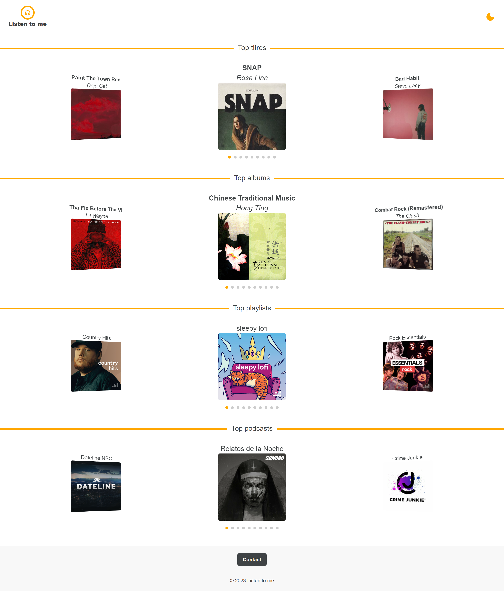

# Listen to me

## Project link

<a href='https://listen-to-me.netlify.app'>https://listen-to-me.netlify.app</a>

## Description 

Listen to me is a website for listening to music and podcasts.<br/>
There's a mode for switching between light and dark moods. <br/>

## Home page



# Stack 

- HTML
- CSS
- Tailwind
- Javascript
- Typescript
- Axios
- Jest 
- Cypress
- React testing library
- Swiper js
- React icons
- React router dom
- Error boundary
- Redux toolkit
- Dotenv
- Netlify functions
- Trello

# Getting started

## Prerequisites

Make sure you have all of the following prerequisites :
- Git - <a href='https://git-scm.com/downloads'>Download and install Git</a>
- Node.js - <a href='https://nodejs.org/en/download'>Download and install Node.js</a>
- Deezer <a href='https://www.deezer.com'>Sign in or register</a>

## Clone the project

```
git clone https://github.com/David-Belleau/listen-to-me.git 
cd listen-to-me
```

## Install the dependencies

```
npm install
```

## Start the project

```
npm start
```

## Launch unit tests

```
npm test
```

## Launch end-to-end test

```
npm run cypress:open
```

# License

Listen to me is MIT licensed.